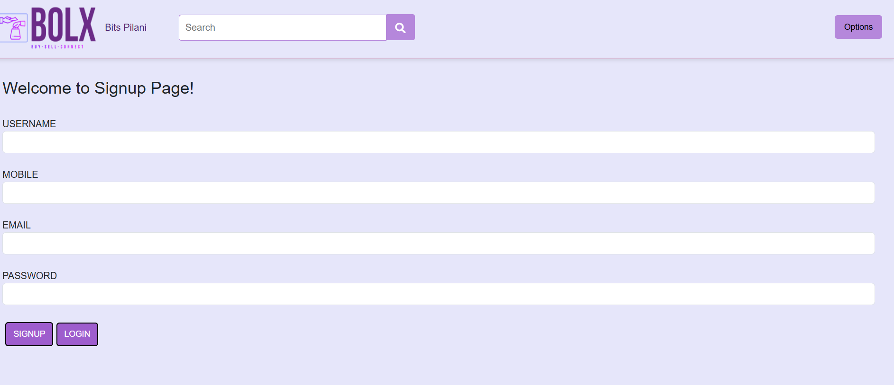

# BITS-OLX
The BOLX (OLX for BITS) application is a digital marketplace tailored for the BITS community. The platform enables students to easily buy, sell, and exchange items such as textbooks, electronics, furniture, and other essentials within the campus. By streamlining these transactions, we aim to foster a more sustainable and budget-friendly ecosystem that encourages students to use pre-owned items.

#  Tech-Stack used
1. MongoDb - Database
2. ExpressJs
3. ReactJs - Frontend
4. NodeJs - Backend

# How to Run
## Running Client

`npm install react-scripts --save`
`cd react-app`
`npm start`

## Running Server
`cd node-app`
`npm install -g nodemon`
`npm install express jsonwebtoken mongoose multer` 
`nodemon index.js`

# Screenshots
 
